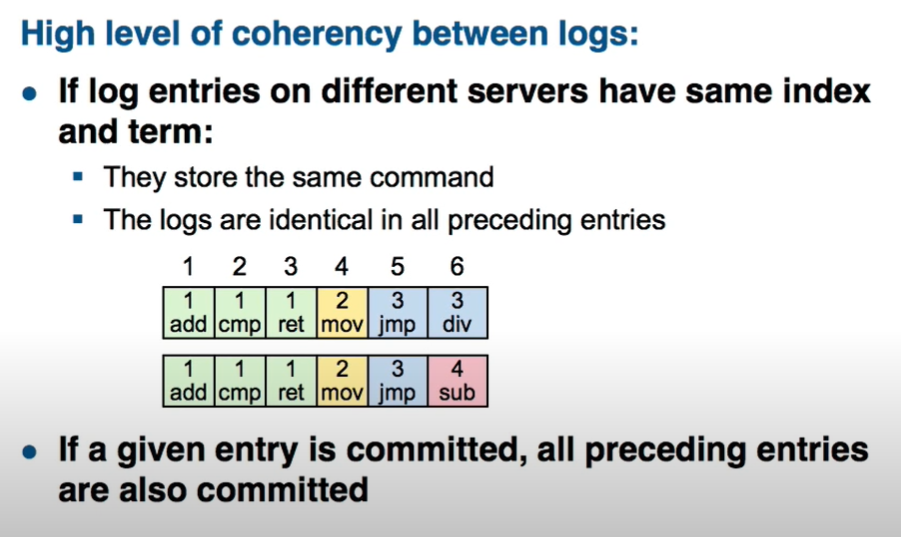
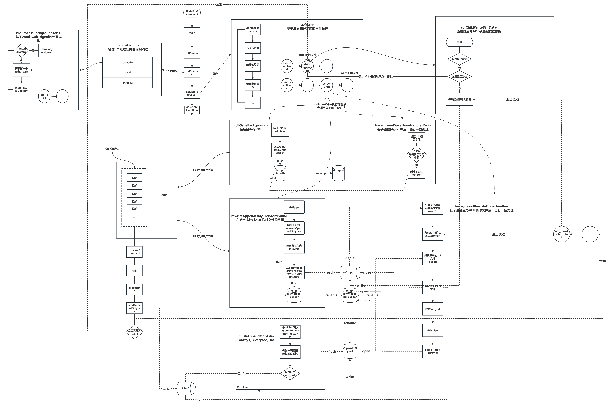

# ftkv
一种具有强一致性的分布式键值对存储系统，基于raft共识算法提供一种可靠的方式来存储需要由分布式系统或机器集群访问的数据。它可以在网络分区期间进行领导者选举，并可以容忍机器故障。
系统分为三个部部分：Server、Client、Router。Router是全局的控制中心，管理Raft Groups的数据分片。Server、Router都使用Raft进行复制。Client支持基本的故障转移。

## 背景
思路来源于[6.824: Distributed Systems Spring 2021](http://nil.csail.mit.edu/6.824/2021/) lab2-lab3。这两个实验实现了一个简易的raft和kvserice，
这个raft虽然实现了论文中提到的大部分功能，如领导者选举、日志共识、日志压缩等，kvservice也能够利用raft达到强一致性和高可用，但也存在不足之处：
raft并没有实现真正的持久化，使用的rpc也不是真正的RPC调用，kvservice不支持删除等等。本着让kvservice成为一个真正可用的键值对存储系统的想法，
[Fault-tolerant Key/Value Service](https://github.com/chong-chonga/FaultTolerantKVService)由此而来。

## 系统架构


## 安装与使用
### 前提条件
请确保系统在运行前已安装1.18及以上版本的golang，安装指导文档可以参照[Download and install](https://go.dev/doc/install)。
例如，在linux上安装1.20.1版本的golang：
```shell
wget https://go.dev/dl/go1.20.1.linux-amd64.tar.gz
rm -rf /usr/local/go && tar -C /usr/local -xzf go1.20.1.linux-amd64.tar.gz
export PATH=$PATH:/usr/local/go/bin
go version
```
1. 运行以下命令克隆本仓库代码
```shell
git clone https://github.com/chong-chonga/FaultTolerantKVService.git
```
2. 克隆成功后，会得到一个名为**FaultTolerantKVService**的文件夹，使用cd命令进入main文件夹
```shell
cd FaultTolerantKVService/main/
```
3. 运行以下命令后，会在本地启动三个KVServer，彼此之间使用raft算法达成共识；可通过命令行交互来测试基础功能
```shell
go run main.go
```

## 开发笔记

在开发FT-KVService时，存在很多问题，以下是我的思考

### 幂等性接口
[6.824: Distributed Systems Spring 2021](http://nil.csail.mit.edu/6.824/2021/)的Service提供Get、Put、Append、Delete四种操作，其中，Append操作不具备幂等性。
由于分布式系统固有的不可靠性，客户端可能会重试请求，因此实验要求我们能够检测到重复的请求，并确保一个请求只会被执行一次。这其实就是设计幂等性接口，这种需求经常出现在”按钮“的场景中，
比如下单、支付、浏览器刷新重新提交表单等。 单机系统中的幂等性接口比较好设计，可以在提交请求前让服务端生成一个标识，服务端在执行完请求后就删除这个标识，表示请求已经被执行过了。
而在分布式系统中，还需要考虑标识的唯一性。为了对请求进行重复性检测，就需要为每个请求生成一个唯一标识。一个客户端会执行发起多次请求，因此可以采用全局唯一客户端标识+序列号来标识每个请求。
具体来说，客户端在发出请求前先分配一个全局唯一标识，在随后的请求中，客户端同时使用自身递增的序列号标识每个请求。这样就只需要在请求的一开始生成一个标识即可，后续的序列号由客户端生成。

在生成全局唯一标识方面，主要有以下几种方式：
1. 使用UUID+时间戳/随机数
2. 使用雪花算法
3. 分布式ID生成器

第一种方式生成的表示不能确保全局唯一，尤其是在分布式系统中。第二种方式比较常用，在这里不考虑。可以利用Raft来构建一个具备容错能力的分布式ID生成器。客户端首先向ID生成器发出请求，
ID生成器利用Raft共识算法对请求进行commit后，对ID进行递增后，将ID返回给客户端。ID是int64类型时，可以生成2^63-1个不同的ID。
如此一来，就解决了为每个客户端生成一个全局唯一标识的问题。由于客户端的序列号也是递增的，因此 服务端可以通过客户端ID+请求序列号来判断请求是否重复，如果序列号不大于
记录的序列号，则说明请求重复。但是，当客户端同时发送多个不同序列号的请求时（比如序列号1-5），问题会更复杂。
1. 无论请求何时到达，这些请求都会被执行。优点：允许客户端同时发送多个请求。缺点：服务端需要记录客户端所有的请求序列号，内存开销会很大。
2. 服务端只能按递增顺序处理请求，后面的请求只能等待前面的请求完成后才能执行。优点：对于每个客户端，只需要记录上次执行的请求的序列号，内存开销小。缺点：只允许客户端一次发送一个请求。

因此，lab3给出了"客户端一次只会发送一个请求，如果请求失败，将会一直重试"这样的假设。
而[Fault-tolerant Key/Value Service](https://github.com/chong-chonga/FaultTolerantKVService)的目标是提供像Redis那样的功能，如Get、Set、Delete操作，不包括Append操作。
Get、Set、Delete本身就带有幂等性。因此无需实现幂等性接口。而Router的`Join、Leave`不具备幂等性，但基本是由系统管理员所使用，使用频率较低，对幂等性要求较强，因此需要采用幂等性设计。


### Server的安全性

- **起因**：我们不希望自己的KVServer被随意访问，因此想要给KVServer加上一层认证措施，只有符合条件的客户端的请求才能被处理。
  这里当然会想到给KVServer设置密码，只有客户端提供正确的密码后，才是通过认证的客户端。
  在通过认证后，分配给客户端一个唯一的标识；客户端后续请求时就携带上这个标识，表明客户端已经通过认证了（因为不希望每次请求都要携带上密码）。
  参照Redis这样的设置，将密码保存在一个配置文件中，KVServer启动时就读取配置文件里保存的密码，并将其与客户端提供的密码进行核对。
- **需求**：标识应当无规律，难以通过暴力尝试手段得到正确的标识，还需要确保生成的客户端标识的是分布式唯一的。
- **思路**：B/S架构下的SessionId是一个参考，可以考虑给每个通过认证的Client生成一个唯一的SessionId(随机串，比如uuid)，根据客户端提供的SessionId参数来验证会话的有效性。
  但是在分布式情境下，即使是基于时间戳并在同一台机器上生成uuid，也是有重复的可能。一般采用的策略是是选择**雪花算法（SnowFlake）**，亦或者利用分布式锁来生成。
  基于Raft提供的强一致性保证，我们可以对标识达成共识，但标识是有可能重复的。可以选择对后续重复的标识回传一个结果，以指示该标识重复，需要重新生成，但这样做会浪费一次
  共识所需的时间。不妨换个思路，利用共识在集群中生成一个唯一的int64整数。我们可以将这个整数作为SessionId的前缀，uuid作为SessionId的后缀。
  而者通过非数字字符相连组成SessionId。 这样生成的uuid发生重复也是没关系的，因为前缀必定是不同的。

#### 细节问题：记录SessionId的数据需要持久化吗(写入到快照)?
可以不持久化，也就是说，Server对SessionId的记录是可以丢失的，下面是我的理解：

**首先考虑单Server的情况：**
当Server崩溃重启时，会读取log并重放，因此Client与Server通信会出现以下几种情况：
1. Client无法与Server通信，则Client将当前SessionId作废。
2. Client发送请求给Server，Server重放日志后，Server仍然有SessionId的记录，那么Server是可以处理Client的请求的(就好像Server没有崩溃一样)。
3. 否则此时SessionId是无效的，Server会拒绝Client的请求，因此Client也会将当前SessionId作废。

即使持久化了，还是会出现上面三种情况(假如Client给Server发请求时，Server还没有将日志完全重放，则SessionId还是无效的)
**Server崩溃了，Client与Server的连接也会断开，RPC调用就会直接失败，是否可以通过这个来直接作废SessionId？**
对于作废的SessionId，由go routine定时清理

**再考虑集群的情况：**
集群相较于单主机可能会复杂一点，但是有一点可以明确：只有Leader才能处理Client的请求。Leader是集群中log最为完整的。
基于Raft提供的强一致性保证，如果Leader没有发生切换，则Client发送给Leader的请求，情况和单Server是一样的。
假如当前Leader崩溃了，那么Client会找到新的Leader，而该Leader的日志至少与前Leader一样新，因此情况和单Server还是一样的。

再思考深一点，如果就是想保证生成的uuid就是唯一的呢，可否用现有的Raft做到？

## 故障模型
KVServer依靠Raft共识算法来达到强一致性，对抗网络分区、宕机等情况。KVServer对外暴露接口供客户端进行RPC调用。
一般情况下，KVServer是以集群的形式存在的，而根据Raft共识算法，只有集群中的Leader才能处理请求。
因此对KVServer的RPC调用在一开始很可能不会成功，所以需要对客户端进行一定的封装，才能更方便地使用KVServer。
在封装Client的过程中，需要给Client的使用者提供一个一致的错误模型。
对KVServer的RPC调用可能出现以下情况：
1. KVServer宕机或Client无法连接到KVServer时，RPC调用无响应。
2. KVServer不是Leader
3. KVServer是Leader并提交了客户端的命令，但可能由于网络延迟等原因，导致命令在很长一段时间内都没有执行完成(也就是没有达成共识)。
4. 客户端的请求执行成功

当有多个KVServer时，对于第一、二种情况来说，Client应尝试调用其他KVServer，只有调用过其他KVServer也无法找到Leader时，才应当认定服务器出现故障。
而对于第三种情况来说，客户端的请求可能会执行也可能不会执行；对客户端而言，命令没有达成共识和网络延迟是一样的情况，请求是否执行对于客户端来说也是不确定的。

## 有哪些地方是可以改进的？
从整个系统层面来看，raft和上层的service就是一个Producer-Consumer关系。raft负责对日志进行一致性复制，并生产committed log给service；service负责消费committed log并执行相应的操作。
另外，raft还负责持久化log和snapshot，某种层面上说，raft也相当于一个存储引擎。因此优化可以分别从两方面入手：生产消息和持久化消息。
### raft层
1. commit log效率低下：根据raft共识算法，log从提交到commit至少需要两轮RPC。如果依赖于`leader`是100ms发送一次`AppendEntries`RPC，可能需要花费200ms左右；而如果在收到新的log就启动一次
`AppendEntries`RPC的话，当提交的log比较频繁时，RPC开销会很大。因此在RPC方面，可以考虑批量发送log（batch），比如在收到一定量的log后再启动RPC。某种程度上，类似于OS的缓冲区思想；另外，如kafka等消息队列的生产者也做了这个优化。
**系统之间的设计相通+1**。
2. log内存复用：go语言的内存也是自动管理的，所以也会进行垃圾回收。因此在快照时截断log的操作可以对log的内存进行复用，而无需释放内存。
### RPC层
可以把RPC看成消息，因此可以对消息进行压缩，从而降低RPC的开销。而GRPC框架提供了高效的序列化。
### 存储层
raft对log和snapshot的持久化无需考虑到查找效率，因此也无需采用B+Tree的形式存储，另外，raft的持久化考虑更多的数据的可靠性，因此也无需采用LSM Tree的存储方式。
但可以考虑对数据进行分片，每个raft负责存储一部分数据，以提高系统的吞吐量。
### 借鉴其他系统的思想
- kafka这样的消息队列，也是按照消息队列的三部分行优化的：生产-存储-消费。在生产消息方面，进行了批处理、压缩、序列化、复用内存。
在存储消息方面，将同一个topic分成多个partition，每个partition类似于raft group，都是负责一部分数据。一个partition的数据又分为多个Segment，每个Segment都负责存储一部分数据（是不是有点像`ConcurrentHashMap`？）。
- Redis这样的内存NoSQL数据库，提供了支持数据分片的Cluster模式、利用IO多路复用监听事件、基于写时复制的后台持久化等等。
- MySQL在数据量比较大的时候，会采用字段的垂直拆分和数据量的水平拆分。同时，MySQL、kafka、Redis的Sentinel模式都是采用Primary-Backup模式复制副本，提高系统的可用性。**系统之间的设计相通+2**。

## 实践思想

### 1. 基于log's index和log's term的生产者-消费者模型

在处理请求方面，基于Raft的KVServer相较于传统的KVServer有很大不同。KVServer是需要等待命令达成共识才能执行请求的。
KVServer将Client的请求包装为一个Command提交给Raft， Raft会将达成共识的KVServer通过Channel发送给KVServer。
这里就引出了一个问题：**对于每个请求，KVServer如何知晓这个请求执行是否成功？**
换个说法，**如何确定从`channel`接收到的log和提交的log的对应关系？**
Service向Raft提交Command时，Raft将Command包装为log，并会返回对应log的`index`和`term`；根据Raft共识算法，index和term确定了log的唯一性。

图片来源于[Raft lecture (Raft user study)](https://www.youtube.com/watch?v=YbZ3zDzDnrw&t=1243s)

**为什么index和term就可以确定唯一的log呢？**

因为follower在收到leader的AppendEntries RPC进行日志复制时，会检查PrevLogIndex处的log的term与leader的是否一致；
如果不一致，follower将会拒绝本次的请求，leader会根据follower回传的信息，选择是发送快照还是将PrevLogIndex减小。
具体可看下面这段Raft代码：
```go
func (rf *Raft) AppendEntries(args *AppendEntriesArgs, reply *AppendEntriesReply) error {
	idx := 0
	i := 0
	//prevLogIndex := args.PrevLogIndex - rf.lastIncludedIndex - 1
	offset := args.PrevLogIndex - rf.lastIncludedIndex
	if offset > 0 {
		/// offset > 0：需要比较第 offset 个 log 的 term，这里减1是为了弥补数组索引，lastIncludedIndex 初始化为 -1 也是如此
		offset -= 1
		// if term of log entry in prevLogIndex not match prevLogTerm
		// set XTerm to term of the log
		// set XIndex to the first entry in XTerm
		// reply false (§5.3)
		if rf.log[offset].Term != args.PrevLogTerm {
			reply.XTerm = rf.log[offset].Term
			for offset > 0 {
				if rf.log[offset-1].Term != reply.XTerm {
					break
				}
				offset--
			}
			reply.XIndex = offset + rf.lastIncludedIndex + 1
			rf.resetTimeout()
			return nil
		}
		// match, set i to prevLogIndex + 1, prepare for comparing the following logs
		i = offset + 1
	} else {
		// offset <= 0：说明log在snapshot中，则令idx加上偏移量，比较idx及其之后的log
		idx -= offset
	}
}
```
因此KVServer可以通过`index`来等待请求执行完成的`signal`，假如回传的命令的term与等待的不符，则说明等待的命令没有达成共识。
在这里我使用的还是go中的`channel(chan)`，KVServer使用map数据结构记录等待中的`channel`（map使用方便）。
KVServer处理Raft回传的Command程序如下：
```go
// startApply listen to the log sent from applyCh and execute the corresponding command.
func (kv *KVServer) startApply() {
	for {
		msg := <- kv.applyCh
		if msg.CommandValid {
			op := msg.Command.(Op)
			commandType := op.OpType
			requestId := op.RequestId
			result := ApplyResult{
				Term: msg.CommandTerm,
			}
			// ...
			// ..。
			if pb.Op_PUT == commandType {
				kv.tab[op.Key] = op.Value
			} else if pb.Op_APPEND == commandType {
				v := kv.tab[op.Key]
				v += op.Value
				kv.tab[op.Key] = v
			} else if pb.Op_DELETE == commandType {
				delete(kv.tab, op.Key)
			} else if GET != commandType {
			}
			kv.commitIndex = msg.CommandIndex
			if ch, _ := kv.replyChan[kv.commitIndex]; ch != nil {
				ch <- result
				close(ch)
				delete(kv.replyChan, kv.commitIndex)
			}
			// ...
			kv.mu.Unlock()
		} else if msg.SnapshotValid {
			// snapshot...
		} else {
			log.Fatalf("[%d] receive unknown type log!", kv.me)
		}
	}
}
```
1. 从applyCh接收命令，根据命令类型执行相应的操作。
2. 会判断对应`index`是否有`channel`正在等待；有的话就回传ApplyResult(包含了Term)，随后从map中删除相关记录，最后close。

对于命令的处理流程，前后修改过很多，两个版本都是直接用本地变量`ch`来接收`signal`，而不是再用map中的`channel`(方便清理map中不用的channel)
只有Leader能提交请求，提交请求后会设置相应的`channel`，并让线程等待直到超时。
#### 第一版
```go
func (kv *KVServer) submit(op Op) (*ApplyResult, pb.ErrCode) {
	commandIndex, commandTerm, isLeader := kv.rf.Start(op)
	if !isLeader {
		return nil, pb.ErrCode_WRONG_LEADER
	}

	kv.mu.Lock()
	if c, _ := kv.replyChan[commandIndex]; c != nil {
		kv.mu.Unlock()
		return nil, pb.ErrCode_TIMEOUT
	}
	ch := make(chan ApplyResult, 1)
	kv.replyChan[commandIndex] = ch
	kv.mu.Unlock()

	var res ApplyResult
	select {
	case res = <-ch:
		break
	case <-time.After(RequestTimeout):
		kv.mu.Lock()
		if _, deleted := kv.replyChan[commandIndex]; deleted {
			kv.mu.Unlock()
			res = <-ch
			break
		}
		delete(kv.replyChan, commandIndex)
		kv.mu.Unlock()
		close(ch)
		return nil, errCode
	}
	if res.Term == commandTerm {
		return &res, pb.ErrCode_OK
	} else {
		return nil, pb.ErrCode_WRONG_LEADER
	}
}
```
有两个问题：
1. 超时时间不应该由KVServer来决定，而应该由Client来决定。

2. `c, _ := kv.replyChan[commandIndex]; c != nil`代码存在bug。

当多个Client向同一个Leader提交请求时，获得的`commandIndex`会不会相同？
设leader1是`term1`的leader，假如出现了网络分区（Server之间的网络存在故障）且Leader1不处于主分区（它和绝大多数Server通信存在网络故障）。
Leader1仍然认为自己是leader（而此时主分区在`term2`选举出了leader2，term2 > term1)，并提交来自客户端的请求，很明显，这些请求不会commit。
leader2在commit一些命令后，与leader1的通信恢复正常。按照Raft共识算法，leader1会trim掉与leader2发生冲突的log，并append来自leader2的log。
只要append的没有trim掉的多，也就说明leader1的log长度减小了。leader1在`term3`重新成为leader，则会出现`commandIndex`相同的情况。
这种情况一出现，就说明先前客户端的命令不可能commit；这时，只需要回传一个result（回传的term必定大于前面等待term)即可。
#### 第二版
```go
func (kv *KVServer) submit(op Op) (*ApplyResult, pb.ErrCode) {
	commandIndex, commandTerm, isLeader := kv.rf.Start(op)
	if !isLeader {
		return nil, pb.ErrCode_WRONG_LEADER
	}
	kv.mu.Lock()
	if c, _ := kv.replyChan[commandIndex]; c != nil {
		c <- ApplyResult{Term: commandTerm}
		close(c)
	}
	ch := make(chan ApplyResult, 1)
	kv.replyChan[commandIndex] = ch
	kv.mu.Unlock()

	res := <-ch
	if res.Term == commandTerm {
		return &res, pb.ErrCode_OK
	} else {
		return nil, pb.ErrCode_WRONG_LEADER
	}
}
```

### 2. 原子性持久化

[Lab 1: MapReduce](http://nil.csail.mit.edu/6.824/2021/labs/lab-mr.html)中，**Worker**的`map`和`reduce`操作的最后需要将数据持久化，
持久化的流程如下：
1. 创建临时文件
2. 将数据写入临时文件
3. 使用系统调用`Rename`将临时文件重命名为目标文件

这种处理流程可以保证覆写是原子性的，可以保证对单个文件的写入是原子操作。其实，常用的KV数据库-**Redis**的`RDB`持久化也是这样做的， RDB持久化的代码（5.0）版本在
[rdb.c](https://github.com/redis/redis/blob/5.0/src/rdb.c)文件中，`rdbSave`源码如下：
```c
/* Save the DB on disk. Return C_ERR on error, C_OK on success. */
int rdbSave(char *filename, rdbSaveInfo *rsi) {
    char tmpfile[256];
    char cwd[MAXPATHLEN]; /* Current working dir path for error messages. */
    FILE *fp;
    rio rdb;
    int error = 0;

    snprintf(tmpfile,256,"temp-%d.rdb", (int) getpid());
    fp = fopen(tmpfile,"w");
    if (!fp) {
        char *cwdp = getcwd(cwd,MAXPATHLEN);
        serverLog(LL_WARNING,
            "Failed opening the RDB file %s (in server root dir %s) "
            "for saving: %s",
            filename,
            cwdp ? cwdp : "unknown",
            strerror(errno));
        return C_ERR;
    }

    rioInitWithFile(&rdb,fp);

    if (server.rdb_save_incremental_fsync)
        rioSetAutoSync(&rdb,REDIS_AUTOSYNC_BYTES);

    if (rdbSaveRio(&rdb,&error,RDB_SAVE_NONE,rsi) == C_ERR) {
        errno = error;
        goto werr;
    }

    /* Make sure data will not remain on the OS's output buffers */
    if (fflush(fp) == EOF) goto werr;
    if (fsync(fileno(fp)) == -1) goto werr;
    if (fclose(fp) == EOF) goto werr;

    /* Use RENAME to make sure the DB file is changed atomically only
     * if the generate DB file is ok. */
    if (rename(tmpfile,filename) == -1) {
        char *cwdp = getcwd(cwd,MAXPATHLEN);
        serverLog(LL_WARNING,
            "Error moving temp DB file %s on the final "
            "destination %s (in server root dir %s): %s",
            tmpfile,
            filename,
            cwdp ? cwdp : "unknown",
            strerror(errno));
        unlink(tmpfile);
        return C_ERR;
    }

    serverLog(LL_NOTICE,"DB saved on disk");
    server.dirty = 0;
    server.lastsave = time(NULL);
    server.lastbgsave_status = C_OK;
    return C_OK;

werr:
    serverLog(LL_WARNING,"Write error saving DB on disk: %s", strerror(errno));
    fclose(fp);
    unlink(tmpfile);
    return C_ERR;
}
```
从这段源码可以看出，Redis的RDB持久化也是先创建一个临时文件，随后调用`rioInitWithFile`初始化`rio`，并根据配置判断是否开启自动刷盘。
然后会调用`rdbSaveRio`执行具体的数据持久化操作，随后将数据刷新到磁盘上并关闭该文件；最后调用`rename`将文件命令重命名为默认为**dump.rdb**。

因此[FaultTolerantKVService](https://github.com/chong-chonga/FaultTolerantKVService)持久化`raft state`和`snapshot`也是使用了这样的方式。

Raft在两种情况下要进行持久化：
1. raft本身状态发生改变时，持久化raft state，较为频繁
2. raft安装snapshot时（快照），持久化raft state 和 snapshot，相对较少
   这两种操作都必须是原子的且必须等待数据真正写入到磁盘，尤其是第二种操作，必须保证raft state和snapshot是一致的。


既然有两种数据需要持久化，因此就引出了另一个问题：将数据保存在一个文件还是多个文件？

● 单个文件：将raft state和snapshot一起存储，就能保证每次写入的原子性，不用担心部分文件写入过程中崩溃，从而导致多个文件保存的数据不一致。缺点就是单次写入的数据量增多，因为每次持久化都要写入snapshot；当snapshot很大时且写入频繁时，写入开销会很大，因此要控制snapshot的大小。

● 多个文件：只持久化raft state时，写入一个文件；同时持久化raft state和snapshot时，写入另一个文件；为了确定两个文件中的raft state哪个更新，可以使用在写入时使用版本号来进行标识。这样写入的好处是避免写入不必要的数据，snapshot的大小不会影响 raft state的写入速度。缺点就是，增大了持久化的复杂度，且读取raft state时要读取两个文件才能确定哪个raft state的版本更大。

将数据写入磁盘所耗费的时间中，大多数情况下数据传输时间占比较小，寻道时间和磁盘旋转时间占了绝大部分。
当写入数据量较小时，更应当确保数据是顺序写入的；如果要在多个不同文件写入数据，则耗费的时间可能比写入单个文件更多。但在上述两种情况中，不管是保存在单个文件还是多个文件，每次写入只会打开一个文件写入，可以认为它们的寻道时间和磁盘旋转时间是一样的，因此它们的不同点在于写入数据量的大小。因此，我选择第二种方案为raft提供持久化。
如果要追求更极致的速度，可以借用[FaRM](https://www.youtube.com/watch?v=UoL3FGcDsE4)的例子，将所有内容都保存在NVDRAM中，在DRAM电源故障时，备用电源会将数据全部保存在SSD中。
由于DRAM和SSD之间的速度差距，使用DRAM的确会非常的快；但不是每个人都能使用NVDRAM存储。 只有在非常追求性能时才能采用。
持久化`raft state`和`snapshot`的代码如下：
```go
type errWriter struct {
	file *os.File
	e    error
	wr   *bufio.Writer
}

func newErrWriter(file *os.File) *errWriter {
	return &errWriter{
		file: file,
		wr:   bufio.NewWriter(file),
	}
}

func (ew *errWriter) write(p []byte) {
	if ew.e == nil {
		_, ew.e = ew.wr.Write(p)
	}
}

func (ew *errWriter) writeString(s string) {
	if ew.e == nil {
		_, ew.e = ew.wr.WriteString(s)
	}
}

func clone(data []byte) []byte {
	d := make([]byte, len(data))
	copy(d, data)
	return d
}

// atomicOverwrite write the buffered data to disk and overwrite the file corresponding to the path
func (ew *errWriter) atomicOverwrite(path string) error {
	err := ew.e
	if err != nil {
		return err
	}
	err = ew.wr.Flush()
	if err != nil {
		return err
	}
	err = ew.file.Sync()
	if err != nil {
		return err
	}
	// close will return an error if it has already been called, ignore
	_ = ew.file.Close()
	err = os.Rename(ew.file.Name(), path)
	if err != nil {
		// deletion failure will not affect, just ignore
		_ = os.Remove(ew.file.Name())
	}
	return err
}

// SaveStateAndSnapshot save both Raft state and K/V snapshot as a single atomic action
// to keep them consistent.
func (ps *Storage) SaveStateAndSnapshot(state []byte, snapshot []byte) error {
	tmpFile, err := os.CreateTemp("", "raft*.rfs")
	if err != nil {
		return &StorageError{Op: "save", Target: "raft state and snapshot", Err: err}
	}
	writer := newErrWriter(tmpFile)
	writer.writeString(fileHeader)
	ps.writeRaftState(writer, state)
	ps.writeSnapshot(writer, snapshot)
	err = writer.atomicOverwrite(ps.snapshotPath)
	if err != nil {
		return &StorageError{Op: "save", Target: "raft state and snapshot", Err: err}
	}
	ps.raftState = clone(state)
	ps.snapshot = clone(snapshot)
	return nil
}

func (ps *Storage) writeRaftState(writer *errWriter, state []byte) {
	writer.writeString(strconv.FormatInt(ps.nextRaftStateVersion, 10) + "\t")
	raftStateSize := len(state)
	writer.writeString(strconv.Itoa(raftStateSize) + "\t")
	if raftStateSize > 0 {
		writer.write(state)
	}
	ps.nextRaftStateVersion++
}

func (ps *Storage) writeSnapshot(writer *errWriter, snapshot []byte) {
	snapshotSize := len(snapshot)
	writer.writeString(strconv.Itoa(snapshotSize) + "\t")
	if snapshotSize > 0 {
		writer.write(snapshot)
	}
}
```
`SaveStateAndSnapshot`方法也是先创建一个临时文件，先写入文件头"RAFT"，然后写入`raft state`的大小、版本号、数据，再写入`snapshot`的大小、数据；
最后，将数据刷新到磁盘上，最后再使用`os.Reanme`将临时文件重命名为目标文件名。

在这个持久化过程中，每次写入都有可能返回`error`，因此将`Writer`包装为`errWriter`，可以将错误留到最后时处理，而不用每次写入都需要对错误进行判断。
这个处理错误的思想来源于go官方的blog：[errors-are-values](https://go.dev/blog/errors-are-values)。

#### 与Redis的持久化对比
要说到键值对存储系统，那就必须得提到[redis](https://github.com/redis/redis)了。
我们知道，Redis有RDB和AOF两种持久化方式，RDB是将Redis所有的数据都保存在文件中，而AOF是将Redis执行的写命令保存在文件中。
RDB的每次写入都是全量的数据写入，随着数据逐渐增多，耗费时间也会增多，文件大小也会越大。
- **为何Raft不采用追加写？**
AOF则是采用追加写（append）来保存写命令，需要注意的是，Redis不是像`write-ahead log`那样在执行命令前就写日志，而是在命令执行后才会写日志，具体可见[sever.c文件中的call](https://github.com/redis/redis/blob/5.0/src/server.c)方法。
很显然，Raft的log的是可以采用上述的追加写的方式进行持久化的，这样就不用每次都重写整个文件的内容了；但鉴于Raft还有诸如`votedFor`、`currentTerm`这样的字段要和log一并保存， 因此不好采用这种追加写的方式来持久化。
- **Raft的刷盘时机**
我们知道[redis](https://github.com/redis/redis)是一个高性能的键值对存储数据库；但同时我们也知道，将数据写入磁盘是非常耗时的。 因此，[redis](https://github.com/redis/redis)是先将
命令的log写入到`aof_buf`，然后再将`aof_buf`中的数据写入到磁盘。[redis](https://github.com/redis/redis)提供了三种刷盘策略：`always`、`everysec`、`none`。
[redis](https://github.com/redis/redis)默认配置是`everysec`，即每秒钟将`aof_buf`写入到磁盘，这是对性能和可靠性的折中，具体可见[aof.c中的flushAppendOnlyFile方法](https://github.com/redis/redis/blob/5.0/src/aof.c)。
Raft共识算法要求log必须在返回response之前就将数据保存在磁盘上，因此采用类似于`always`策略。

在阅读redis源码后，其持久化流程大致如下：


[在线访问该图片](https://www.processon.com/view/link/6412a9db19abb33de950aef4)

## 参考
这两个课程视频对实现Raft有很大的帮助：
1. [Lecture 6: Fault Tolerance: Raft (1)](https://www.youtube.com/watch?v=64Zp3tzNbpE&list=PLrw6a1wE39_tb2fErI4-WkMbsvGQk9_UB&index=6)
2. [Lecture 7: Fault Tolerance: Raft (2)](https://www.youtube.com/watch?v=4r8Mz3MMivY&list=PLrw6a1wE39_tb2fErI4-WkMbsvGQk9_UB&index=7)

如果想要进一步了解Raft共识算法，建议不要先看知乎或者博客，可以先看原作者[Raft lecture (Raft user study)](https://www.youtube.com/watch?v=YbZ3zDzDnrw)
另外，想要了解Paxos共识算法，也可以看看他的[Paxos lecture (Raft user study)](https://www.youtube.com/watch?v=JEpsBg0AO6o&t=318s)；
我的亲身经历告诉我，这篇[Paxos算法的乱七八糟讲解的博客](https://www.cnblogs.com/linbingdong/p/6253479.html)的内容和原作者的视频的内容极为相似，
相似就算了，关键是内容有错误，看了文章后对算法本身认识就有误区，后来还是看原作者的视频才醒悟过来。

阅读Redis5.0的源码对理解实际的键值对数据库是如何设计的有很大帮助：
[redis5.0](https://github.com/redis/redis/blob/5.0/src)
